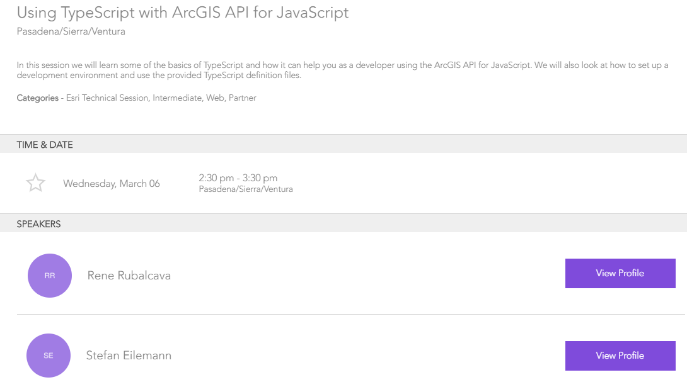
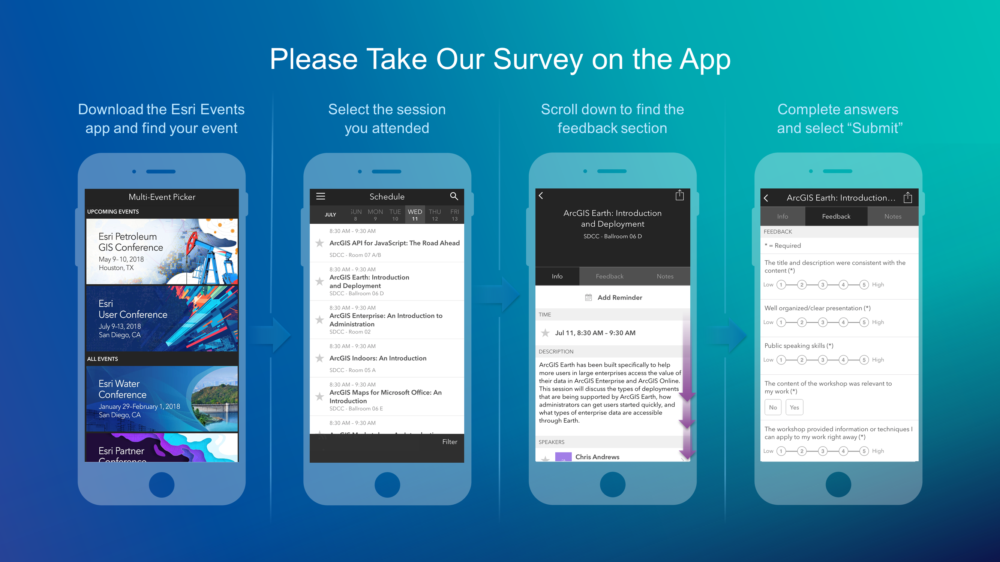

<!-- .slide: data-background="../reveal.js/img/bg-1.png" -->
<!-- .slide: class="title" -->
 
 
 
### Intro to TypeScript
 
Kelly Hutchins and Noah Sager
----

### **Agenda**
 
 - What is TypeScript?
 - Why use TypeScript?
 - Setup and First steps
 - Live Action Demo

----

### **Where do I begin?**

----

### **Which version of the API is best?**

----

### **Developer Setup**
 

----

### **JSAPI Resources**
 

 - Includes
   - JSHint file
   - TypeScript definition file
   - Build tools, e.g. Bower
   - OAuth popup callback

----

### **Get the API**
 
 - <a href="https://developers.arcgis.com/javascript/latest/guide/get-api/index.html#cdn" target="_blank">CDN</a>
 - Custom builds
 - <a href="https://developers.arcgis.com/downloads/" target="_blank">Download builds</a>
 
 
<pre style="display:inline-block; padding: 5px; margin: 10px auto; width: 100%;"><code data-trim> 
&lt;link rel=&quot;stylesheet&quot; href=&quot;https://js.arcgis.com/4.10/esri/css/main.css&quot;&gt; 
&lt;script src=&quot;https://js.arcgis.com/4.10/&quot;&gt;&lt;/script&gt;
</code></pre>

----

### **Demo: Build a TypeScript app from scratch**

----

### **Where can I get more info?**

- SDK Documentation
- Esri-related training and webinars
- JavaScript online training, free and not-so-free
- User forums, e.g. GeoNet, StackExchange, Spatial Community in Slack, etc. 
 
<a href="https://developers.arcgis.com/javascript/support/index.html" target="_blank">

----

### **Additional TypeScript Session**

<a>

----

<a>

---

<a>