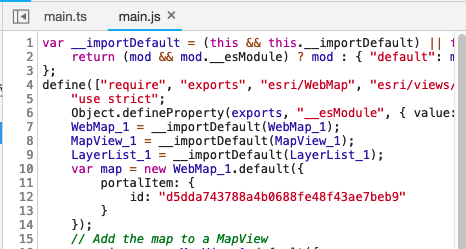
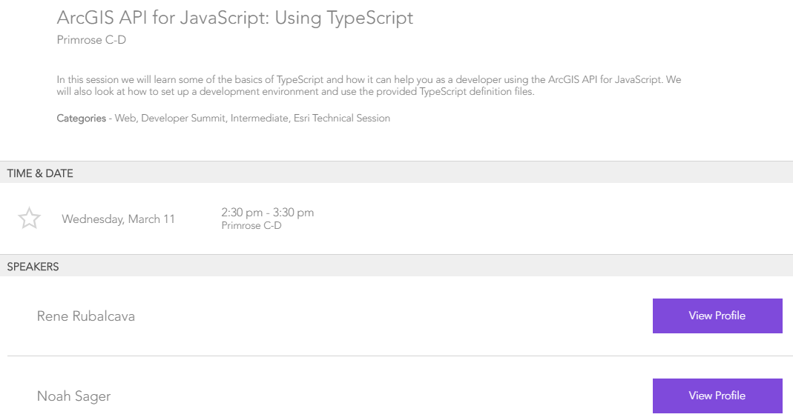

<!-- .slide: data-background="../reveal.js/img/background.jpg" -->
<!-- .slide: class="title" -->
<br>
<br>
<br>
### Intro to TypeScript
<br>
Kelly Hutchins and Noah Sager
</br>
</br>
Presentation:
</br>
<a href="https://noashx.github.io/DevSummit/2020/Intro-to-TypeScript" target="_blank">https://noashx.github.io/DevSummit/2020/Intro-to-TypeScript</a>

----

### **Agenda**
</br>
 - What is TypeScript?
 - Why use TypeScript?
 - Setup and First steps
 - Live Action Demo
 - Where can I get more info?

----

### **What is TypeScript?**
<a href="https://www.typescriptlang.org/" target="_blank">

</a>

----

### **Where do I begin?**
<a href="https://www.typescriptlang.org/" target="_blank">

</a>

----

### **Developer Setup**
</br>
<a href="https://developers.arcgis.com/javascript/latest/guide/typescript-setup/index.html" target="_blank">

</a>

----

### **Why use TypeScript?**
</br>
TypeScript adds `type` support to JavaScript
</br>


----

### **Why use TypeScript?**
</br>
Enhanced IDE support
</br>


----

### **Why use TypeScript?**
</br>
Makes use of the latest JavaScript features
</br>


----

### **Why use TypeScript?**
</br>
Makes use of the latest JavaScript features
</br>


----

## DEMO: Convert sample to TypeScript

<a href="" alt="Link to sample javascript app"></a>

----


## Step 1: TypeScript setup

<a href="https://developers.arcgis.com/javascript/latest/guide/typescript-setup/" alt="Link to TypeScript doc">Getting Started Guide</a>


----

## Step 2: Create TypeScript file 
  Rename .js files to .ts 

  


----

## Step 3: Compiler options 

- Defines TypeScript project 
- <a href="demo/livedemo/tsconfig.json"  alt ="Opens the tsconfig.json file for the demo app">tsconfig.json</a> file 
  
```
{
  "compilerOptions": {
    "module": "amd",
    "noImplicitAny": true,
    "esModuleInterop": true,
    "sourceMap": true,
    "jsx": "react",
    "jsxFactory": "tsx",
    "target": "es5",
    "experimentalDecorators": true
  }
}
```

----

## Step 4a: Transpile TypeScript
* Use tsc to convert to es5 JavaScript file 
* Add to <a href="demo/livedemo/package.json"  alt ="Opens the package.json file for the demo app">Package.json</a> 

```
{
  "scripts": {
    "dev": "tsc -w",
    "build": "tsc"
  }
}
```


----

## Step 4b: Transpile TypeScript
 Visual Studio Code 


----


## Step 5a: Fix errors
Convert AMD module declaration 

```
require([
  "esri/Map",
  "esri/layers/FeatureLayer",
  "esri/views/MapView",
  "esri/geometry/geometryEngine"
], function (Map, FeatureLayer, MapView, geometryEngine) {


```
To ES6 style <a src="MDN web doc for import" target="_blank" href="https://developer.mozilla.org/en-US/docs/Web/JavaScript/Reference/Statements/import">imports</a> 

```
import Map from "esri/Map";
import FeatureLayer from "esri/layers/FeatureLayer";
import MapView from "esri/views/MapView";
import { geodesicLength } from "esri/geometry/geometryEngine";

```

----

## Tip: ES6 module import 

- Add `esModuleInterop` to tsConfig
  
```
// Import all contents 
import watchUtils as * from "esri/core/watchUtils";

watchUtils.whenDefinedOnce(slider, "values",function(){});

```

```
// Import a single export  
import { whenDefinedOnce } from "esri/core/watchUtils";

whenDefinedOnce(slider, "values",function(){});

```

```
// Import multiple exports  
import { whenDefinedOnce, whenEqualOnce } from "esri/core/watchUtils";

whenDefinedOnce(slider, "values",function(){});
whenEqualOnce(....)

```

----

## Step 5b: Fix errors 

Cannot find name 'geometryEngine'


----


## Step 5c: Fix errors

Type '{ title: string; id: string; className: string; }[]' is not assignable to type 'CollectionProperties ActionButton | ActionToggle'.


----

## Tip: Use __esri instead of import
- Only contains type interfaces
- Use when not instantiating type
  
```
var measureThisAction = {
  title: "Measure",
  id: "measure-this",
  className: "esri-icon-measure"
} as __esri.ActionButton;

```
----

 ## Step 6: Ready to test 

Transpilation successful


----

 ## Step 7: Modernize Code 

* Const and let
  * Find - replace var to const  
  * Use let when needed
  
  

----
 ## Step 7b: Modernize Code

<a target="_blank" alt="Object property shorthand doc" href="https://alligator.io/js/object-property-shorthand-es6/">Object Property Value Shorthand</a>


----


 ## Step 7c: Modernize Code 

<a target="_blank" alt="MDN doc on template literals" href="https://developer.mozilla.org/en-US/docs/Web/JavaScript/Reference/Template_literals">Template Literals</a>
 
```
// String concatenation 
view.popup.selectedFeature.attributes.Name 

+ " trail is " + distance + "miles long.";

```
 <br>
 
```
// Template Literals 
   `${view.popup.selectedFeature.attributes.Name} trail is ${distance} miles long.`

```


----

## Tip: Debugging with source maps
  - Enable source maps in browser dev tools
  - Set breakpoints in .ts instead of .js

  

----

## Tip: Hide .js and .jsmap files 

- Reduce clutter
- VSCode: Add below to user preferences in files.exclude

```
 **/*.js.map": true,
        "**/*.js": {
            "when": "$(basename).ts

```

----


### **Where can I get more info?**

- SDK Documentation
- Esri-related training and webinars
- ArcGIS Blogs
- GeoNet, StackExchange, Spatial Community in Slack, etc.</br>
</br>
<a href="https://www.esri.com/arcgis-blog/products/js-api-arcgis/mapping/using-typescript-with-the-arcgis-api-for-javascript/" target="_blank">


----

### **Additional TypeScript Session**

<a>

----

<a>

---

<a>
