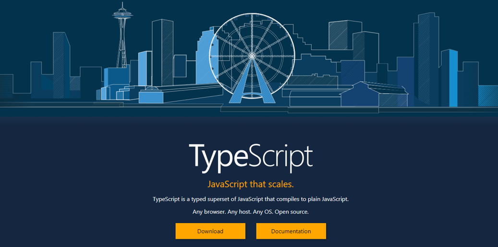

<!-- .slide: data-background="../img/2021/dev-summit/bg-1.png" data-background-size="cover -->
<h1 style="text-align: left; font-size: 80px;">Intro to TypeScript</h1>
<p style="text-align: left; font-size: 30px;">Kelly Hutchins | <a href="https://twitter.com/kellyhutchins">@kellyhutchins</a></p>
<p style="text-align: left; font-size: 30px;">Noah Sager | <a href="https://twitter.com/Noashx">@noashx</a></p>
<p style="text-align: left; font-size: 30px;"></p></br>
<p style="text-align: left; font-size: 20px;">Presentation slides: <a href="https://noashx.github.io/DevSummit/2021/Intro-to-TypeScript">https://noashx.github.io/DevSummit/2021/Intro-to-TypeScript</a></p>

---

<!-- .slide: data-auto-animate data-background="../img/2021/dev-summit/bg-3.png" -->
## Agenda
</br>

 - What is TypeScript?
 - Why use TypeScript?
 - Real-life Demo
 - Where can I get more info?

---

<!-- .slide: data-auto-animate data-background="../img/2021/dev-summit/bg-2.png" -->
## What is TypeScript?

<a href="https://www.typescriptlang.org/" target="_blank">

</a>

---

<!-- .slide: data-auto-animate data-background="../img/2021/dev-summit/bg-2.png" -->
## Where do I begin?

<a href="https://www.typescriptlang.org/" target="_blank">

</a>

---

<!-- .slide: data-auto-animate data-background="../img/2021/dev-summit/bg-2.png" -->
## **Developer Setup**

<a href="https://developers.arcgis.com/javascript/latest/guide/typescript-setup/index.html" target="_blank">

</a>

---

<!-- .slide: data-auto-animate data-background="../img/2021/dev-summit/bg-2.png" -->
## **Developer Setup**

<a href="https://developers.arcgis.com/javascript/latest/guide/typescript-setup/index.html" target="_blank">

</a>

---

<!-- .slide: data-auto-animate data-background="../img/2021/dev-summit/bg-2.png" -->
## Benefits


- Easier for multiple people to work on
- Easier to refactor
- Easier to test
- Can help prevent technical debt

---

<!-- .slide: data-auto-animate data-background="../img/2021/dev-summit/bg-2.png" -->
## Why use TypeScript?
</br>
TypeScript adds <b>type</b> support to JavaScript
</br>
</br>


---

<!-- .slide: data-auto-animate data-background="../img/2021/dev-summit/bg-2.png" -->
## Why use TypeScript?
</br>
Enhanced IDE support
</br>


---

<!-- .slide: data-auto-animate data-background="../img/2021/dev-summit/bg-2.png" -->
## Why use TypeScript?
</br>
Makes use of the latest JavaScript features
</br>
</br>


---

<!-- .slide: data-auto-animate data-background="../img/2021/dev-summit/bg-2.png" -->
## Why use TypeScript?
</br>
Makes use of the latest JavaScript features
</br>
</br>


---

<!-- .slide: data-auto-animate data-background="../img/2021/dev-summit/bg-2.png" -->
## Setup and First steps

1. The recommended way to install TypeScript is via `node` and `npm`.

2. Make sure to install TypeScript globally: <br>
```bash
npm install -g typescript
```
3. Install the ArcGIS API for JavaScript Typings: <br>
```bash
npm install --save @types/arcgis-js-api
```

---

<!-- .slide: data-auto-animate data-background="../img/2021/dev-summit/bg-2.png" -->
## **Demo: Build a TypeScript app from scratch**


---

<!-- .slide: data-auto-animate data-background="../img/2021/dev-summit/bg-2.png" -->
## Tip: Hide .js and .jsmap files
</br>
- Reduce clutter
- VSCode: Add below to user preferences in files.exclude

```
 **/*.js.map": true,
        "**/*.js": {
            "when": "$(basename).ts

```

---

<!-- .slide: data-auto-animate data-background="../img/2021/dev-summit/bg-2.png" -->
## Tip: Debugging with source maps
  - Enable source maps in browser dev tools
  - Set breakpoints in .ts instead of .js

  

---

<!-- .slide: data-auto-animate data-background="../img/2021/dev-summit/bg-2.png" -->
## Tip: Use __esri instead of import
- Only contains type interfaces
- Can use when not instantiating type
```
import esri = __esri;
const layerList = new LayerList({
  view,
  listItemCreatedFunction: event => {
    const item = event.item as __esri.ListItem;
  }
});
```

---

<!-- .slide: data-auto-animate data-background="../img/2021/dev-summit/bg-2.png" -->
## Where can I get more info?

- SDK Documentation
- Esri-related training and webinars
- ArcGIS Blogs
- GeoNet, StackExchange, etc.</br>
</br>
<a href="https://www.esri.com/arcgis-blog/products/js-api-arcgis/mapping/using-typescript-with-the-arcgis-api-for-javascript/" target="_blank">


---

<!-- .slide: data-auto-animate data-background="../img/2021/dev-summit/bg-1.png" -->
## **Additional TypeScript Session**


---

<!-- .slide: data-auto-animate data-background="../img/2021/dev-summit/bg-5.png" -->


---

<!-- .slide: data-auto-animate data-background="images/2021-feedback.jpg" -->