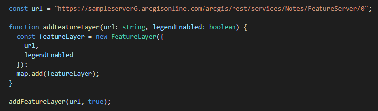

<!-- .slide: data-background="../reveal.js/img/bg-1.png" -->
<!-- .slide: class="title" -->
<br>
<br>
<br>
### Intro to TypeScript
<br>
Kelly Hutchins and Noah Sager
</br>
</br>
Presentation:
</br>
<a href="https://noashx.github.io/DevSummit/2019/Intro-to-TypeScript" target="_blank">https://noashx.github.io/DevSummit/2019/Intro-to-TypeScript</a>

----

### **Agenda**
</br>
 - What is TypeScript?
 - Why use TypeScript?
 - Setup and First steps
 - Live Action Demo
 - Where can I get more info?

----

### **What is TypeScript?**
<a href="https://www.typescriptlang.org/" target="_blank">

</a>

----

### **Where do I begin?**
<a href="https://www.typescriptlang.org/" target="_blank">

</a>

----

### **Developer Setup**
</br>
<a href="https://developers.arcgis.com/javascript/latest/guide/typescript-setup/index.html" target="_blank">

</a>

----

### **Why use TypeScript?**
</br>
TypeScript adds `type` support to JavaScript
</br>


----

### **Why use TypeScript?**
</br>
Enhanced IDE support
</br>


----

### **Why use TypeScript?**
</br>
Makes use of the latest JavaScript features
</br>


----

### **Why use TypeScript?**
</br>
Makes use of the latest JavaScript features
</br>


----

### **Setup and First steps**
<br></br>
1. The recommended way to install TypeScript is via `Node` and `npm`.
<br></br>
2. Make sure to install TypeScript globally: <br>
<pre style="display:inline-block; padding: 5px; margin: 10px auto; width: 100%;"><code data-trim>
npm install -g typescript
</code></pre>
<br></br>
3. Install the ArcGIS API for JavaScript Typings: <br>
<pre style="display:inline-block; padding: 5px; margin: 10px auto; width: 100%;"><code data-trim>
npm install --save @types/arcgis-js-api
</code></pre>
<br></br>

----

### **Demo: Build a TypeScript app from scratch**


----
### **Tip: Hide .js and .jsmap files **

- Reduce clutter
- VSCode: Add below to user preferences in files.exclude

```
 **/*.js.map": true,
        "**/*.js": {
            "when": "$(basename).ts

```

----
### **Tip: Debugging with source maps**
  - Enable source maps in browser dev tools
  - Set breakpoints in .ts instead of .js

  

----
### **Tip: Use __esri instead of import**
- Only contains type interfaces
- Can use when not instantiating type
```
import esri = __esri;
const layerList = new LayerList({
  view,
  listItemCreatedFunction: event => {
    const item = event.item as __esri.ListItem;
  }
});
```
----

### **Where can I get more info?**

- SDK Documentation
- Esri-related training and webinars
- ArcGIS Blogs
- GeoNet, StackExchange, Spatial Community in Slack, etc.</br>
</br>
<a href="https://www.esri.com/arcgis-blog/products/js-api-arcgis/mapping/using-typescript-with-the-arcgis-api-for-javascript/" target="_blank">


----

### **Additional TypeScript Session**

<a>

----

<a>

---

<a>
